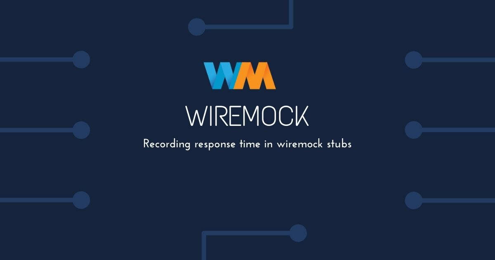

[Wiremock](http://wiremock.org/) is a wonderful tool for mocking external dependencies for testing. I often swap out the external dependencies/services of an application with wiremock during the application load test.

Wiremock provides a nice [recording/snapshotting](http://wiremock.org/docs/record-playback/) feature to capture live flows and create stubs from them. It simplifies the effort to create stubs for load tests. I run all my test cases once, record the interactions with dependencies as stubs. These stubs can then be used to perform the load test without invoking dependencies.

I like Wiremock's answers to imitate the actual dependency, including the response time of the dependency. It will influence the statistics (e.g. thread waiting times) of the app under test. Wiremock, however, does not record the response time. I did not find any solution on the web, so I read through [wiremock documentation for extensions](http://wiremock.org/docs/extending-wiremock/) and came with a solution. It may not be the best or the simplest, but so far it has worked out for me.

The solution has three steps.

1. Capture timestamp when the request has been received by wiremock.
2. Capture timestamp when the response has been received by wiremock, from the backend system.
3. Register the difference as delay in wiremock stubs.

---

### 1. Capture timestamp when the request has been received by wiremock.

Wiremock provides a RequestFilter to intercept incoming requests. The CustomRequestFilter below intercepts the request and records the timestamp as a request header. This header will be used in further steps.

###### [CustomRequestTransformer.java](https://gist.github.com/anuragashok/640e88d42b7ab7b69a40806f0002f337#file-customrequesttransformer-java)

```java
import com.github.tomakehurst.wiremock.extension.requestfilter.RequestFilterAction;
import com.github.tomakehurst.wiremock.extension.requestfilter.RequestWrapper;
import com.github.tomakehurst.wiremock.extension.requestfilter.StubRequestFilter;
import com.github.tomakehurst.wiremock.http.Request;

public class CustomRequestTransformer extends StubRequestFilter {

  public static final String HEADER_KEY_START_TIME = "X-Start-Time";

  @Override
  public RequestFilterAction filter(Request request) {

    Request wrappedRequest = RequestWrapper.create()
        .addHeader(HEADER_KEY_START_TIME, String.valueOf(System.currentTimeMillis()))
        .wrap(request);

    return RequestFilterAction.continueWith(wrappedRequest);
  }

  @Override
  public String getName() {
    return "CustomRequestTransformer";
  }
}
```

### 2. Capture timestamp when the response has been received by wiremock from the backend system.

After the response is received, wiremock runs ResponseTransformers on it. This CustomResponseTransformer below determines when the response was received. It then retrieves the start timestamp from the header added in Step 1. Then the transformer calculates the response time or delay and adds it as a header in the response.

###### [CustomResponseTransformer.java](https://gist.github.com/anuragashok/640e88d42b7ab7b69a40806f0002f337#file-customresponsetransformer-java)

```java
import static com.sia.csl.devtools.mock.CustomRequestTransformer.HEADER_KEY_START_TIME;

import com.github.tomakehurst.wiremock.common.FileSource;
import com.github.tomakehurst.wiremock.extension.Parameters;
import com.github.tomakehurst.wiremock.extension.ResponseTransformer;
import com.github.tomakehurst.wiremock.http.HttpHeader;
import com.github.tomakehurst.wiremock.http.Request;
import com.github.tomakehurst.wiremock.http.Response;

public class CustomResponseTransformer extends ResponseTransformer {

  public static final String HEADER_KEY_RES_TIME = "X-Response-Time";

  @Override
  public Response transform(Request request, Response response, FileSource files,
      Parameters parameters) {

    if (null != request.getHeaders().getHeader(HEADER_KEY_START_TIME)) {
      long startTime = Long.parseLong(request.getHeaders().getHeader(HEADER_KEY_START_TIME).firstValue());
      long endTime = System.currentTimeMillis();
      int delay = Math.toIntExact(endTime - startTime);
      return Response.Builder.like(response).but().headers(
          response.getHeaders().plus(new HttpHeader(HEADER_KEY_RES_TIME, String.valueOf(delay))))
          .build();
    }

    return response;
  }

  @Override
  public String getName() {
    return "CustomResponseTransformer";
  }

  @Override
  public boolean applyGlobally() {
    return false;
  }
}
```

### 3. Record the difference as delay in wiremock stubs.

Wiremock invokes StubMappingTransformer extensions, to modify StubMappings before they are saved. The CustomStubMappingTransformer below retrieves the delay from the response header added in Step 2. It then modifies the StubMapping to add the delay. The new StubMapping now has our desired request, response and also response time as a delay.

###### [CustomStubMappingTransformer.java](https://gist.github.com/anuragashok/640e88d42b7ab7b69a40806f0002f337#file-customstubmappingtransformer-java)

```java
import static com.sia.csl.devtools.mock.CustomResponseTransformer.HEADER_KEY_RES_TIME;

import com.github.tomakehurst.wiremock.client.ResponseDefinitionBuilder;
import com.github.tomakehurst.wiremock.common.FileSource;
import com.github.tomakehurst.wiremock.extension.Parameters;
import com.github.tomakehurst.wiremock.extension.StubMappingTransformer;
import com.github.tomakehurst.wiremock.http.ResponseDefinition;
import com.github.tomakehurst.wiremock.matching.EqualToXmlPattern;
import com.github.tomakehurst.wiremock.matching.RequestPatternBuilder;
import com.github.tomakehurst.wiremock.stubbing.StubMapping;

public class CustomStubMappingTransformer extends StubMappingTransformer {

  @Override
  public StubMapping transform(StubMapping stubMapping, FileSource fileSource,
      Parameters parameters) {

    if (null != stubMapping.getResponse().getHeaders().getHeader(HEADER_KEY_RES_TIME)) {
      int delay = Integer.parseInt(
          stubMapping.getResponse().getHeaders().getHeader(HEADER_KEY_RES_TIME).firstValue());
      final ResponseDefinition newResponseDefinition = ResponseDefinitionBuilder
          .like(stubMapping.getResponse()).but().withFixedDelay(delay).build();
      stubMapping.setResponse(newResponseDefinition);
    }

    return stubMapping;
  }

  @Override
  public boolean applyGlobally() {
    return false;
  }

  @Override
  public String getName() {
    return "CustomStubMappingTransformer";
  }

}
```

The 3 extensions previously created need to be registered with wiremock. Registration can be global or per-stub base. We have to register the delay only when proxying the request to a real backend. I was using the snapshotting method, therefore, extensions were registered only with the proxy stubs. If you use the new record feature, you could enable the extensions globally and add conditional logic inside the transformers.

Do [contact me](https://www.linkedin.com/in/anurag-ashok/), if there is a simpler solution or if you would like to discuss.
